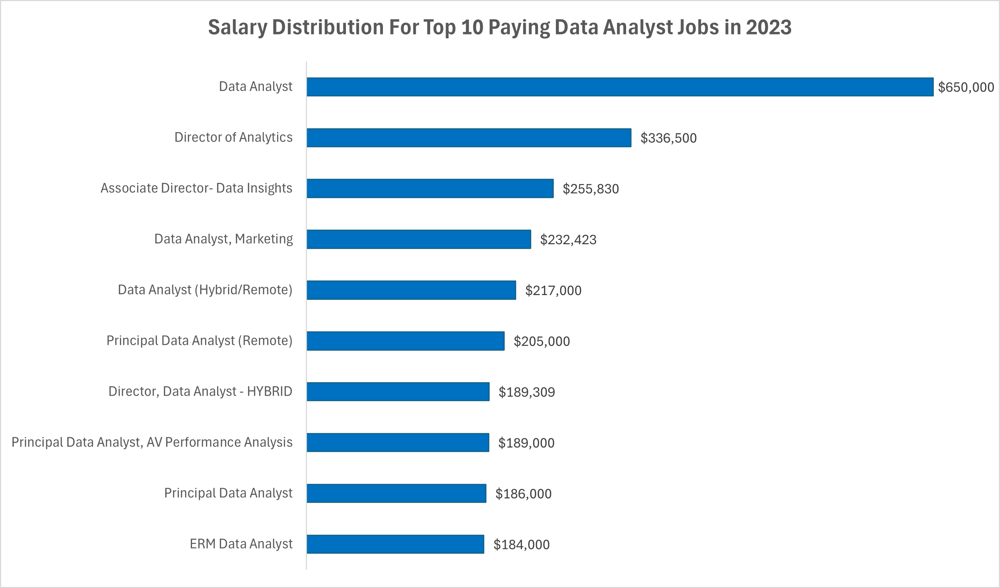

# Introduction
## 📊Data Analysis Jobs and Skills Exploration
Welcome to this SQL Project focused on the Data Analyst job market. In it we will discover the 💰top-paying jobs, 🔥in-demand skills, and 📈 the intersection of these where high demand meets high salary.

If you like to read SQL queries, I've got you covered!😉  Check out this link: [sql_project folder](/sql_project/)

# Background
The data for this project comes from Luke Barousse's [SQL course](https://www.lukebarousse.com/sql).  It's packed with insights on job titles, locations, companies, salaries, and required skills.

My purpose in doing this project was to advance my SQL skills while querying data of interest to anyone looking to optimize their skillset for the data analyst job market.

### The questions I wanted to answer through my SQL queries were:
1. What are the top-paying data analyst jobs?
2. What skills are required for these top-paying jobs?
3. What skills are most in demand for all data analysts?
4. Which skills are associated with higher salaries?
5. What are the most optimal skills to learn given the results of the 3rd and 4th queries?
# Tools I Used
For my exploration of the data analyst job market, I strengthened my skills in some tools and learned brand new ones in others:
- **SQL:** The backbone of my analysis, allowing me to query the database and unearth critical insights.
- **PostreSQL:** The chosen database management system, ideal for handling the job posting data.
- **Visual Studio Code:** My new go-to for database management and executing SQL queries.
- **Git and GitHub:** Essential for version control and sharing my SQL scripts and analysis, ensuring collaboration and project tracking.
- **Excel:** Useful for its chart functionality to visualize query results for better understanding.

# The Analysis
Each query for this project aimed at investigating specific aspects of the data analyst job market. Here’s how I approached each question:
### 1. Top Paying Data Analyst <u>Jobs</u>
In this query I filtered for remote data analyst positions with a stated salary, sorting by salary in descending order to find only the top 10 jobs.
```sql
SELECT 
    job_id,
	job_title,
	job_location,
	job_schedule_type,
	salary_year_avg,
	job_posted_date,
    name AS company_name
FROM
    job_postings_fact
LEFT JOIN company_dim ON job_postings_fact.company_id = company_dim.company_id
WHERE
    job_title_short = 'Data Analyst' AND
    job_location = 'Anywhere' AND
    salary_year_avg IS NOT NULL
ORDER BY
    salary_year_avg DESC
LIMIT 10;
```
Here's the breakdown of the top 10 paying data analyst jobs in 2023:
- **Salary Range:** Salaries for these data analyst roles range significantly from $184,000 to $650,000.
- **Diverse Employers:** Companies like Mantys, Meta, AT&T, Pinterest, UCLA Healthcareers, and SmartAsset are offering these lucrative positions, highlighting the demand for data analysts across diverse industries.
- **Job Titles:** The roles include a variety of titles such as Data Analyst, Director of Analytics, Associate Director-Data Insights, Data Analyst-Marketing, and ERM Data Analyst, showcasing a range of positions from entry-level to senior leadership in data analysis.


*Excel bar graph visualizing my SQL query results*

### 2. <u>Skills</u> For <u>Top Paying</u> Jobs
To understand what skills are required for these top-paying jobs, I joined the job postings with the skills data, providing insights into what employers value for high-compensation roles.
```sql
WITH top_paying_jobs AS (
    SELECT 
        job_id,
        job_title,
        salary_year_avg,
        name AS company_name
    FROM
        job_postings_fact
    LEFT JOIN company_dim ON job_postings_fact.company_id = company_dim.company_id
    WHERE
        job_title_short = 'Data Analyst' AND
        job_location = 'Anywhere' AND
        salary_year_avg IS NOT NULL
    ORDER BY
        salary_year_avg DESC
    LIMIT 10
)
SELECT 
    top_paying_jobs.*,
    skills
FROM top_paying_jobs
INNER JOIN skills_job_dim ON top_paying_jobs.job_id = skills_job_dim.job_id
INNER JOIN skills_dim ON skills_job_dim.skill_id = skills_dim.skill_id
ORDER BY
    salary_year_avg DESC;
```
Here's the breakdown of the most demanded skills for the top 10 highest paying data analyst jobs in 2023:
- **Top 3:** SQL, Python, Tableau with 8, 7 and 6 instances respectively
- **Varied Technical Skills** like r, pandas, azure and good ol' excel are sought after and highly compensated
    

*Excel bar graph visualizing my SQL query results*

### 3. Most <u>In-Demand Skills</u> for Data Analysts
This query identified the most frequently occurring skills mentioned in job postings across all data analyst roles.
```sql
SELECT 
    skills,
    COUNT(job_postings_fact.job_id) AS demand_count
FROM job_postings_fact
INNER JOIN skills_job_dim ON job_postings_fact.job_id = skills_job_dim.job_id
INNER JOIN skills_dim ON skills_job_dim.skill_id = skills_dim.skill_id
WHERE
    job_title_short = 'Data Analyst'
GROUP BY
    skills
ORDER BY
    demand_count DESC
LIMIT 10;

-- Query filtered down to entry-level Data Analyst job skills
SELECT 
    skills,
    COUNT(job_postings_fact.job_id) AS demand_count
FROM job_postings_fact
INNER JOIN skills_job_dim ON job_postings_fact.job_id = skills_job_dim.job_id
INNER JOIN skills_dim ON skills_job_dim.skill_id = skills_dim.skill_id
WHERE
    job_title_short = 'Data Analyst' AND
    (job_title LIKE '%Entry%' OR job_title LIKE '%Junior%'
    OR job_title LIKE '%Beginner%')
GROUP BY
    skills
ORDER BY
    demand_count DESC
LIMIT 10
```
💡I also ran the second query shown above to identify any differences in entry-level data analyst skills based on job titles containing "junior", "entry", or "beginner".  *The only difference from the table of skills shown below is that for entry-level jobs, excel was slightly more prevalent than SQL.* 

| Skills    | Demand Count |
|-----------|--------------|
| SQL       | 92628        |
| excel     | 67031        |
| python    | 57326        |
| tableau   | 46554        |
| power bi  | 39468        |

*Table for the top 5 most in-demand skills in data analyst job postings.*

### 4. <u>Skills</u> Based On <u>Salary</u>
Exploring the average salaries associated with different skills revealed which skills are the highest paying.
```sql
SELECT 
    skills,
    ROUND(AVG(salary_year_avg),0) AS avg_salary
FROM job_postings_fact
INNER JOIN skills_job_dim ON job_postings_fact.job_id = skills_job_dim.job_id
INNER JOIN skills_dim ON skills_job_dim.skill_id = skills_dim.skill_id
WHERE
    job_title_short = 'Data Analyst' AND
    salary_year_avg IS NOT NULL
GROUP BY
    skills
ORDER BY
    avg_salary DESC
LIMIT 50;

-- Query filtered down to top paying skills for entry-level Data Analysts
SELECT 
    skills,
    ROUND(AVG(salary_year_avg),0) AS avg_salary
FROM job_postings_fact
INNER JOIN skills_job_dim ON job_postings_fact.job_id = skills_job_dim.job_id
INNER JOIN skills_dim ON skills_job_dim.skill_id = skills_dim.skill_id
WHERE
    job_title_short = 'Data Analyst' AND
    salary_year_avg IS NOT NULL AND
    (job_title LIKE '%Entry%' OR job_title LIKE '%Junior%'
    OR job_title LIKE '%Beginner%')
GROUP BY
    skills
ORDER BY
    avg_salary DESC
LIMIT 50;
```
Summary of top paying skills for experienced vs entry-level data analysts:
- **Specialized vs. Foundational Skills:** Experienced data analysts command higher salaries for specialized and advanced technical skills, while entry-level positions emphasize foundational skills and general programming knowledge.
- **DevOps and Data Engineering:** There is a significant demand for DevOps and advanced data engineering skills among experienced analysts, whereas entry-level roles focus more on basic data management and visualization.
- **Machine Learning:** Advanced machine learning frameworks and tools are highly valued for experienced roles, while entry-level positions require a more basic understanding of these technologies.
- Overall, the data highlights the progression from foundational skills at the entry level to more specialized, high-paying skills as data analysts gain experience and expertise.

### 5. Most <u>Optimal Skills</u> To Learn
📣🥁Now for the moment we've all been waiting for - the query that answers the question of where aspiring data analysts should focus their efforts given the vast array of tools and the limited resources of time and money available to them.  The hottest skills with the highest associated salaries are revealed below. 👇🏻
```sql
SELECT 
    skills_dim.skill_id,
    skills_dim.skills,
    COUNT(skills_job_dim.job_id) AS demand_count,
    ROUND(AVG(job_postings_fact.salary_year_avg),0) AS avg_salary
FROM 
    job_postings_fact
INNER JOIN 
    skills_job_dim ON job_postings_fact.job_id = skills_job_dim.job_id
INNER JOIN
    skills_dim ON skills_job_dim.skill_id = skills_dim.skill_id
WHERE
    job_postings_fact.job_title_short = 'Data Analyst' AND
    salary_year_avg IS NOT NULL
    --AND
    --(job_postings_fact.job_title LIKE '%Entry%' OR job_postings_fact.job_title LIKE '%Junio%'
    --OR job_postings_fact.job_title LIKE '%Begin%')
GROUP BY    
    skills_dim.skill_id,
    skills_dim.skills
HAVING 
    COUNT(skills_job_dim.job_id) >10
ORDER BY 
    demand_count DESC,
    avg_salary DESC
```
- **Core Skills:** Master SQL, Excel, and Python for a strong foundation in data manipulation and analysis (no surprises here!).
- **Visualization Tools:** Learn Tableau or Power BI to effectively present data insights.  (Tableau appeared 5,654 more times than Power BI.)
- **Statistical and Big Data Analysis:** Acquire skills in R, SAS, Spark, and TensorFlow for staistical analysis and machine learning.
- **Cloud Computing and Collaboration:** Gain proficiency in AWS, Azure, Git, and Confluence for cloud data management and effective teamwork.

💼 If landing a job in data analysis is the priority, focus on the skills in the below graph which shows the top 20 skills appearing in job postings:


*Excel chart visualizing SQL query results sorted by top 20 skill count in 2023 job postings*

💰If earning the highest salary is the prioirty, acquire the niche skills shown in the below graph, but note that there is much lower demand for them per the 2023 job postings:

*Excel chart visualizing SQL query results sorted by salary showing the top 20 salaries.*

# What I Learned
I've learned so much working through this project including:

- 📊 **Advanced SQL Skills:** Used complex queries, table merging, WITH clauses for temporary table operations, data aggregation functions like COUNT() and AVG() with GROUP BY clauses.  Gained copious experience trouble-shooting said complex queries. 😊
- 💡 **Analytical Skills:** Improved my ability to answer questions with the right SQL queries to provide actionable insights.
- 🛠️ **GitHub:** first-ever use of GitHub as a repository for my code and project write-up
- 💻**Visual Studio Code:** Debut user of this code editor to manage my PostreSQL queries and GitHub commits
- 🖊️ **Markdown**: First time interacting with Markdown to create this ReadMe file that I hope has been easy to digest.
# Conclusions
1. **Top-Paying Data Analyst Jobs:** There's a wide variety in salaries, job titles, and industries needing data analysts.
2. **Skills for Top-Paying Jobs:** SQL, python, tableau, and r are the top 4 skills required for the highest paying jobs.
3. **Most In-Demand Skills:** SQL is also the most demanded skill in the overall data analyst job market, while excel was the most demanded for job titles indicating entry-level roles.
4. **Skills with Higher Salaries:** Specialized skills, such as Kafka, Pytorch, and Tensorflow are associated with the highest average salaries, indicating a premium on niche expertise.
5. **Optimal Skills for Job Market Value:** SQL leads in demand and offers a high average salary, positioning it as one of the most optimal skills for data analysts to learn to maximize their market value.
### 🏁 Closing Thoughts
This project enhanced my SQL skills and provided valuable insights into the data analyst job market.  The findings from the analysis serve as a guide to prioritizing skill development and job search efforts.  Aspiring data analysts can better position themselves in a competitive job market by focusing on high-demand, high-salary skills.  This exploration highlights the importance of continuous learning and adaptation to emerging trends in the field of data analytics.
